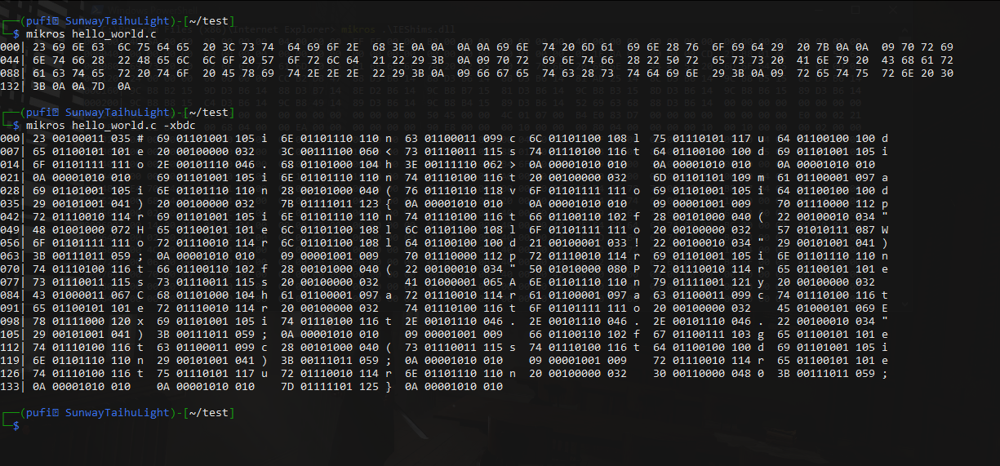

# Mikros-Hex-Viewer

Experience versatile file analysis with this compact command-line hex viewer, allowing you to inspect files in multiple data representations (at once), including hexadecimal, binary, decimal, and character.



## Download and Compilation
### Prerequisites:
- git
- gcc
- make

Clone the repository and run the Makefile:
```shell
git clone https://github.com/ThomasWaytec/Mikros-Hex-Viewer.git
cd ./Mikros-Hex-Viewer
make
```

## Usage
Type in ```./mikros``` followed by the name of the file you'd like to analyze.  
Add any optional arguments after.
### Output Format Arguments:
 - ```-x``` for hexadecimal (default)
 - ```-d``` for decimal
 - ```-b``` for binary
 - ```-c``` for character

You may use more than one format at once.  
The arguments can also be combined: ```-xdbc```
### Examples:
``` shell
./mikros username.txt
./mikros file.bin -b
./mikros images/photo.jpg -d -b
./mikros README.md -xbdc
```
Enhance your usage of Mikros-Hex-Viewer by adding its folder path to your Bash or PowerShell path environment variable. This will enable you to conveniently use mikros from any location in your command-line.
